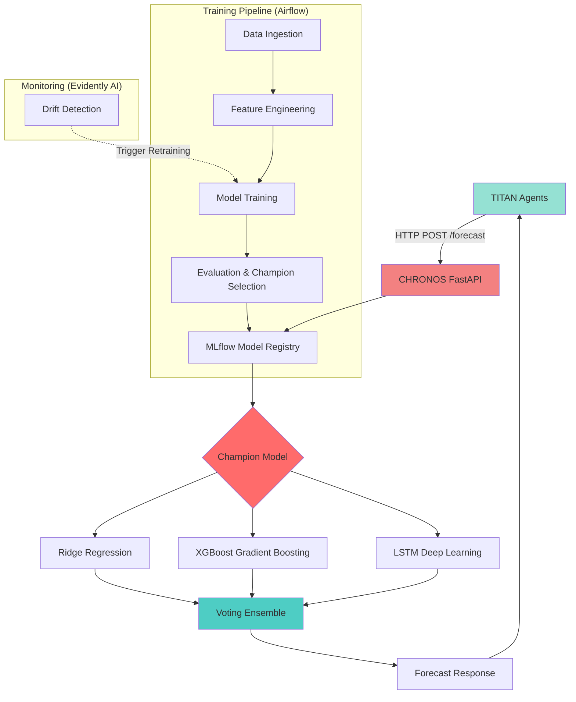

# 🏦 CHRONOS: MLOps Forecasting Platform

**Production-Grade Time-Series Forecasting with Automated Retraining**

[](https://www.python.org/)
[](https://fastapi.tiangolo.com/)
[](https://mlflow.org/)
[](https://airflow.apache.org/)

---

## 📖 Executive Summary

**CHRONOS** is an end-to-end MLOps platform for financial forecasting. It demonstrates production-grade machine learning engineering through automated pipelines, ensemble modeling, drift detection, and seamless integration with the **TITAN** agentic platform.

**Key Features:**

- 🔄 **Automated Retraining**: Self-healing models via drift detection
- 🎯 **Ensemble Voting**: Ridge + XGBoost + LSTM with champion selection
- ⚡ **Big Data Processing**: PySpark for distributed feature engineering
- 📊 **MLOps Stack**: Airflow orchestration + MLflow tracking + Evidently monitoring
- 🚀 **Production API**: FastAPI serving with <100ms latency
- 🤖 **TITAN Integration**: Powers forecast capabilities for autonomous financial agents

---

## 🏗️ System Architecture



---

## 🛠️ Tech Stack

| Component           | Technology              |
| ------------------- | ----------------------- |
| **Orchestration**   | Apache Airflow 2.8      |
| **Model Tracking**  | MLflow 2.10             |
| **Big Data**        | PySpark 3.5             |
| **Drift Detection** | Evidently AI 0.4        |
| **API Framework**   | FastAPI + Uvicorn       |
| **Database**        | PostgreSQL 16           |
| **Deployment**      | Docker + Cloud Run      |
| **CI/CD**           | GitHub Actions + Poetry |

---

## 🚀 Quick Start

### Prerequisites

- Python 3.12+ with Poetry
- Docker & Docker Compose
- Ubuntu 24.04

### Installation

    # Clone repository
    git clone https://github.com/rauldgarcia/chronos.git
    cd chronos

    # Install dependencies
    poetry install

    # Download historical data
    poetry run python chronos/data/ingestion.py

    # Start API server
    poetry run uvicorn chronos.api.main:app --reload

### Test the API

    # Health check
    curl http://localhost:8000/health

    # Get stock data
    curl http://localhost:8000/data/AAPL

---

## 📊 Project Roadmap

### ✅ Phase 1: Foundation (Week 1)

- \[x\] Project initialization with Poetry + Git setup
- \[x\] Yahoo Finance data ingestion (5 years historical data)
- \[x\] Basic FastAPI endpoints (`/health`, `/data/{ticker}`)
- \[x\] Fix NaN handling in API responses
- \[x\] Unit tests for data ingestion (Pytest + Mocks)
- \[x\] Docker Compose setup (Postgres + MLflow + Airflow)
- \[x\] Database integration (SQLAlchemy + Postgres connection)
- \[x\] Airflow DAG: Automated Daily Ingestion Pipeline

### 🔄 Phase 2: Feature Engineering (Week 2)

- \[x\] PySpark configuration for robust data processing
- \[x\] Technical indicators distributed calculation (Moving Averages, Volatility)
- \[x\] Lag features and time-series transformations
- \[x\] Feature store creation in PostgreSQL (stock_features table)
- \[x\] Airflow DAG: Feature engineering pipeline integration
- \[x\] Data validation with Great Expectations

### 🤖 Phase 3: Model Training (Week 3-4)

- \[ \] Ridge Regression baseline model
- \[ \] XGBoost gradient boosting model
- \[ \] LSTM deep learning model (TensorFlow + CUDA)
- \[ \] Voting Ensemble implementation
- \[ \] MLflow experiment tracking and model registry
- \[ \] Champion model selection logic
- \[ \] Airflow DAG: Training orchestration

### 📈 Phase 4: Monitoring & Deployment (Week 5-6)

- \[ \] Evidently AI drift detection
- \[ \] Automated retraining triggers
- \[ \] FastAPI `/forecast/{ticker}` endpoint
- \[ \] TITAN integration (Forecast Agent)
- \[ \] Docker containerization
- \[ \] Cloud Run deployment
- \[ \] CI/CD pipeline (GitHub Actions)

---

## 📂 Project Structure

```
chronos/
├── chronos/
│ ├── api/ # FastAPI application
│ ├── data/ # Data ingestion and validation
│ ├── features/ # Feature engineering (PySpark)
│ ├── models/ # ML models (Ridge, XGBoost, LSTM, Ensemble)
│ └── utils/ # Database, MLflow, Spark utilities
├── airflow/
│ └── dags/ # Airflow pipelines
├── tests/ # Pytest unit and integration tests
├── docker/ # Dockerfiles
└── data/ # Local data storage (git ignored)
```

---

## 🧪 Testing

    # Run all tests
    poetry run pytest -v

    # Run with coverage
    poetry run pytest --cov=chronos

---

## 🔧 Development

    # Format code
    poetry run ruff format .

    # Lint code
    poetry run ruff check .

    # Type check
    poetry run mypy chronos

---

## 📝 License

Private Portfolio Project - Raúl Daniel García Ramón

---

**Built with ❤️ by [Raúl García](https://github.com/rauldgarcia)**
