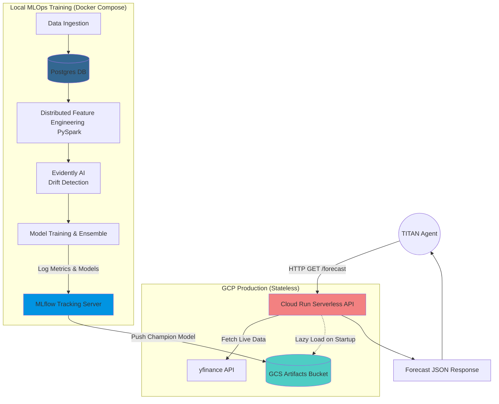

# 🏦 CHRONOS: Enterprise MLOps Forecasting Platform

**Production-Grade Time-Series Forecasting with Serverless Dual-Mode Architecture**

[](https://www.python.org/)
[](https://fastapi.tiangolo.com/)
[](https://mlflow.org/)
[](https://airflow.apache.org/)
[](https://cloud.google.com/)
[](https://spark.apache.org/)

---

## 📖 Executive Summary

**CHRONOS** is an end-to-end MLOps platform for financial forecasting, serving as the core predictive engine for the **TITAN** agentic ecosystem. 

It demonstrates Senior-level Machine Learning Engineering by implementing a robust pipeline that includes distributed feature engineering, an ensemble of models (Ridge, XGBoost, LSTM), data drift detection, and an innovative **"Show, Don't Pay" Dual-Mode Architecture** for cost-optimized cloud deployment.

### ✨ Key Technical Highlights:
- 🔄 **Automated Retraining**: Self-healing models via **Evidently AI** drift detection.
- 🎯 **Ensemble Voting**: Dynamic Champion Model selection (Ridge + XGBoost + LSTM).
- ⚡ **Big Data Processing**: **PySpark** for distributed, scalable feature engineering.
- 🚀 **Serverless Production API**: Deployed to **Google Cloud Run** parsing live market data, achieving near-zero latency and $0 idle costs (scales to zero).
- 🏗️ **Modern DAG Orchestration**: Built following **Airflow 2.x** and **Cloud Composer** standards (TaskFlow API, TaskGroups, Dynamic Task Mapping).
- 🤖 **TITAN Integration**: Exposes a stateless API for autonomous financial agents.

---

## 🏛️ "Show, Don't Pay" Dual-Mode Architecture

To demonstrate Enterprise Cloud capabilities without incurring the heavy costs of running Cloud SQL or Vertex AI clusters 24/7 for a portfolio project, CHRONOS utilizes a **Dual-Mode Serving Architecture** controlled by the `ENVIRONMENT` variable:

1. **`LOCAL` Mode (For Development & Recruiters) 💻**
   - Uses **PostgreSQL** for storing historical features.
   - Uses a local **MLflow Tracking Server** to log experiment metrics, handle the Model Registry, and determine the Champion Model.
   - Perfect for a standard `docker-compose up` experience.

2. **`PRODUCTION` Mode (For TITAN API) ☁️**
   - **100% Stateless & Serverless**.
   - The MLflow training pipeline zips and uploads the Champion Model artifacts to a **Google Cloud Storage (GCS)** bucket.
   - The **FastAPI Cloud Run container** lazy-loads the model from GCS on startup.
   - It fetches live OHLCV data directly via `yfinance` and computes the PySpark-equivalent features *in-memory* on the fly.
   - **Result:** Enterprise-grade inference with **$0 database/server costs**.

---

## 🏗️ System Architecture Flow



---

## 🛠️ Tech Stack

| Domain | Technology |
| --- | --- |
| **Cloud Services** | Google Cloud Run, Google Cloud Storage (GCS) |
| **Orchestration** | Apache Airflow 2.8 (TaskFlow API, Cloud Composer standard) |
| **Model Tracking** | MLflow 2.10 |
| **Data Processing** | PySpark 3.5, Pandas, NumPy |
| **Machine Learning** | Scikit-Learn, XGBoost, TensorFlow (CPU optimized), Evidently AI |
| **API Framework** | FastAPI, Uvicorn, Pydantic |
| **Database (Local)** | PostgreSQL 16, SQLAlchemy |
| **CI / CD** | GitHub Actions (Ruff Linting, Pytest, Docker Build & Push) |
| **Dependency Mgmt**| Poetry (PEP-621) |

---

## 🚀 Quick Start (For Recruiters)

Want to run the full MLOps pipeline on your local machine? Follow these steps.

### Prerequisites
- Python 3.12+ and Poetry
- Java 17 (Required locally for PySpark feature engineering)
- Docker & Docker Compose

### 1. Infrastructure Setup
```bash
# Clone repository
git clone https://github.com/rauldgarcia/CHRONOS.git
cd CHRONOS

# Install dependencies
poetry install

# Configure environment (Create a .env file)
echo "AIRFLOW_UID=50000" > .env
echo "ENVIRONMENT=local" >> .env
echo "POSTGRES_USER=chronos_test" >> .env
echo "POSTGRES_PASSWORD=chronos_test_password" >> .env
echo "POSTGRES_DB=chronos_test_db" >> .env
echo "POSTGRES_SERVER=postgres" >> .env
echo "POSTGRES_PORT=5432" >> .env

# Spin up Postgres, MLflow, and Airflow
sudo docker-compose up -d --build
```

### 2. Run the MLOps Pipeline
You can trigger the pipeline natively via Python to see PySpark and MLflow in action:
```bash
# 1. Ingestion
poetry run python chronos/data/ingestion.py

# 2. PySpark Distributed Feature Engineering
poetry run python chronos/features/build_features.py

# 3. Train Models & Upload to MLflow
poetry run python chronos/models/train.py
```
> 💡 *Check the MLflow Dashboard at `http://localhost:5000` to see the logged experiments, MSE metrics, and the selected Champion Model (Ridge, XGBoost, or LSTM).*

### 3. Test the API (Local Mode)
```bash
# Start the FastAPI server locally
poetry run uvicorn chronos.api.main:app --reload

# Request a forecast (it will query Postgres and the MLflow Model Registry)
curl http://localhost:8000/forecast/AAPL
```

---

## 🤖 API Usage (Production Mode)

The API is fully deployed on **Google Cloud Run** via GitHub Actions. If you are integrating CHRONOS into an external agent (like TITAN), simple hit the live endpoint:

```bash
curl -X 'GET' \
  'https://chronos-api-XXXXXXXX.us-central1.run.app/forecast/AAPL' \
  -H 'accept: application/json'
```

**Response Example:**
```json
{
  "ticker": "AAPL",
  "target_date": "2026-04-14T00:00:00",
  "predicted_close": 178.43,
  "model_used": "XGBoost",
  "model_run_id": "gs://chronos-artifact-bucket/models/AAPL/champion.json",
  "environment": "production"
}
```

---

## 📈 Project Roadmap

### ✅ Phase 1: Foundation
- [x] Project initialization with Poetry + GitHub Actions CI.
- [x] Yahoo Finance data ingestion.
- [x] Docker Compose setup (Postgres + MLflow + Airflow).
- [x] Database integration (SQLAlchemy + Postgres connection).

### ✅ Phase 2: Feature Engineering
- [x] PySpark configuration for robust data processing.
- [x] Technical indicators distributed calculation (SMA, Volatility, Returns).
- [x] Data validation pipelines (Great Expectations).

### ✅ Phase 3: Model Training
- [x] MLflow experiment tracking and model registry.
- [x] Ridge Regression, XGBoost, and LSTM deep learning models.
- [x] Meta-Voting Ensemble implementation.
- [x] Automated Champion selection logic based on lowest MSE.

### ✅ Phase 4: Production Serving
- [x] "Show, Don't Pay" Dual-Mode Architecture implementation.
- [x] Cloud Storage (GCS) Model Artifact push hook.
- [x] FastAPI forecast endpoint with stateless lazy-loading.
- [x] Docker image optimization (`tensorflow-cpu` memory unbloating).

### ✅ Phase 5: Monitoring & Deployment
- [x] Airflow DAG migration to **Cloud Composer Standards** (Airflow 2.x TaskFlow, TaskGroups).
- [x] Evidently AI drift detection automated HTML repoting.
- [x] Complete CI/CD Pipeline (Linting, Pytest, Docker Build, Cloud Run Deploy).
- [x] Ready for **TITAN Integration**.

---

## 📝 License
Private Portfolio Project - Raúl Daniel García Ramón

---
**Built with ❤️ by [Raúl García](https://github.com/rauldgarcia)**
